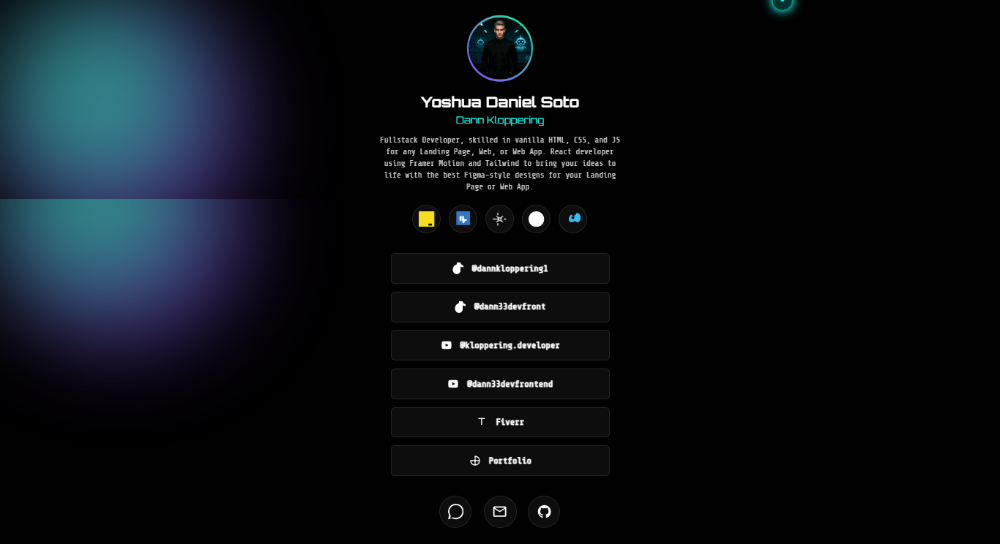

## 🌐 Linktree Personal – React + TypeScript

# 📌 Descripción

Este proyecto es una página personal estilo Linktree desarrollada con React + TypeScript, usando Framer Motion para animaciones fluidas y TailwindCSS para el estilado.
Incluye un background dinámico con CSS puro y una estructura adaptable y minimalista para centralizar enlaces a redes sociales, portafolio y contactos.

# 🚀 Características

⚡ Construido con React + TypeScript.

🎨 Estilos rápidos y responsivos con TailwindCSS.

🎬 Animaciones suaves con Framer Motion.

🖌 Fondo animado con CSS puro.

🔗 Enlaces centralizados a redes sociales, Fiverr y portafolio.

📱 Diseño responsive y minimalista.

# 🛠 Tecnologías

React

TypeScript

TailwindCSS

Framer Motion

CSS3

# 📂 Instalación

Clona este repositorio e instala dependencias:

git clone https://github.com/YoshuaSoto95/Futuristic-Portfolio-Linktree.git
cd linktree-personal
npm install

Ejecuta el proyecto en local:

npm run dev

# 📷 Capturas

Ver Live: https://dannkloppering-linktree.netlify.app/

📜 Créditos

Creado por Yoshua Daniel Soto

Inspirado en la idea de Linktree

Generación de ideas y apoyo en código: Google AI Studio